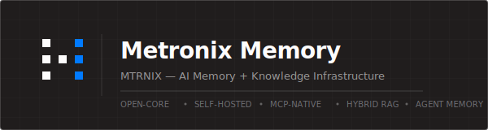

<p align="center">
  
</p>

**Open-source AI memory infrastructure.**  
Hybrid RAG, durable agent memory, MCP tools, and local-model support.

**[Install](#install)** | [Runtime Guides](#choose-your-runtime-guide) | [Quick Reference](#quick-reference) | [Docs](#documentation)

---

## What This Is

Metronix Memory is a self-hosted backend for AI agents and chat clients:

- ingest company knowledge from files and connectors
- query it through MCP, REST, or an OpenAI-compatible API
- store durable agent memory with workspace and agent scoping
- run on your own infra with Ollama or external model providers

**Self-hosting matters.** Your data, credentials, and knowledge graph should run in your own environment when compliance or privacy requires it.

**Metronix Core** is the open-source answer: hybrid RAG + persistent agent memory + freshness pipeline. Self-hosted. MCP-native. Built for AI agents, not just chatbots.


| Your Agents Need         | Without Metronix                                    | With Metronix                                                                 |
| ------------------------ | --------------------------------------------------- | ----------------------------------------------------------------------------- |
| Search company knowledge | Build separate integrations and ingestion pipelines | Connect sources and query through one RAG surface                             |
| Persistent agent memory  | Reset every session or store raw notes              | `fact`, `preference`, and `pinned` memory records                             |
| Freshness checks         | Stale facts remain forever                          | Link, reconcile, monitor, curate, and review memory                           |
| Agent-native access      | Custom tools per runtime                            | Built-in MCP server for Cursor, Claude Desktop, Hermes, and other MCP clients |
| Self-hosted deployment   | Cloud-only memory or managed RAG                    | Docker Compose on your infrastructure                                         |


---


## Architecture

Metronix Core uses a strict one-way dependency architecture - each layer only imports downward.

```text
L6  api/            REST + OpenAI-compatible API + MCP HTTP mount
L5  channels/       Legacy Telegram, Discord, Slack integrations
L4  agent/          Intent router and compatibility shims
L3  services        Connectors, LLM, MCP, memory, auth, workspaces, knowledge
L2  processing      Ingestion, retrieval, freshness pipeline
L1  storage/        PostgreSQL, Qdrant, Neo4j, Redis clients
L0  core/           Config, models, events, plugin interfaces
```

**[Open interactive architecture diagram](docs/architecture-diagram.html)** - works offline in your browser.

### Key Pipelines


| Pipeline      | Flow                                                         | What it does                                                                                 |
| ------------- | ------------------------------------------------------------ | -------------------------------------------------------------------------------------------- |
| **Ingestion** | Fetch -> Parse -> Chunk -> Embed -> Store                    | Incremental sync from connectors and files. PDF, HTML, Office, text, and tabular processors. |
| **Retrieval** | Classify -> Expand -> Recall -> Rerank -> Score -> Answer    | Dense vectors + SPLADE sparse retrieval + graph context + source citations.                  |
| **Freshness** | Linker -> Reconciler -> Monitor -> Curator -> DecisionEngine | Detects stale or conflicting memory and knowledge records.                                   |
| **Memory**    | Store -> Search -> Review -> Assemble                        | Persistent agent memory scoped by workspace and agent.                                       |


---


## Install

Get a backend running in four steps. This is the shortest path; for the full guide
(prerequisites, Open WebUI, ports, troubleshooting) see [install.md](install.md).

> **Requirements:** Docker with **≥6 GB RAM** (8 GB recommended) and ~15 GB free disk. The
> default Docker Desktop allotment (~2 GB) is too small for the full stack plus the local
> graph model and will OOM-kill syncs — raise it under Settings → Resources → Memory.


### 1. Clone

```bash
git clone https://github.com/mtrnix/metronix-memory.git
cd metronix-memory
```

**Quick install** — one script replaces steps 2–4: checks Docker, writes `.env`, builds and
starts the stack, health-checks the API, and optionally wires Hermes.

```bash
./install.sh                              # agent memory (default)
./install.sh --mode answers --chat-url https://api.deepseek.com/v1 \
  --chat-model deepseek-chat --openwebui -y   # chat UI + answer generation
```

Flags: `--mode memory|answers`, `--chat-url`, `--chat-model`, `--chat-api-key`, `--openwebui`,
`--wire-hermes`, `--reconfigure`, `-y` (`./install.sh --help`).

*Prefer manual setup? Continue with step 2 below.*

### 2. Configure: set the MCP key in `.env`

```bash
cp .env.example .env
```

For **agent memory over MCP** (Hermes, Cursor, …) you only need the MCP auth key. Embeddings for ingest come from the bundled Ollama container (`nomic-embed-text`), and a small graph model (`qwen2.5:3b`) is pulled alongside it for knowledge-graph extraction — both on first
`docker compose up`. No external chat LLM is required in `.env`.

```bash
METRONIX_MCP_API_KEY=...   # generate: openssl rand -hex 32
```

Optional — only if you run **Open WebUI** or want Metronix to generate answers itself:

```bash
LLM_PROVIDER=custom
LLM_PROVIDER_URL=https://your-llm-endpoint/v1   # e.g. https://api.deepseek.com/v1
LLM_PROVIDER_API_KEY=your-key
LLM_PROVIDER_MODEL=deepseek-chat                # model the endpoint serves
```


### 3. Launch (first run builds images + pulls embedding model, ~10–15 min)

```bash
docker compose up -d --build
```


### 4. Verify

```bash
curl http://localhost:8000/health
```

A healthy backend exposes the REST API, the OpenAI-compatible API at `:8000/v1`, and the
MCP endpoint at `:8000/mcp` (default on the host: `http://localhost:8000/mcp` — the
`metronix-full-api` container, path `/mcp`; from Docker network: `http://metronix-core:8000/mcp`).
If you have installed the KnowledgeBase-UI (e.g. [http://localhost:3000](http://localhost:3000)), log in with your Metronix credentials.
Default credentials:

```bash
login: admin@metronix.local
pass: metronix
```


### 5. Quick Validation

Verify the full memory lifecycle (store and retrieve) using either the REST API or the
native MCP Streamable HTTP interface.

#### Option A: REST API

**Step A — Authenticate (get a JWT token)** using the default admin credentials
(`admin@metronix.local` / `metronix`):

- **Linux/macOS (Bash):**
  ```bash
  TOKEN=$(curl -s -X POST -H "Content-Type: application/json" -d '{"email": "admin@metronix.local", "password": "metronix"}' http://localhost:8000/api/v1/auth/login | jq -r '.token')
  ```
- **Windows PowerShell:**
  ```powershell
  $response = Invoke-RestMethod -Method Post -Uri "http://localhost:8000/api/v1/auth/login" -ContentType "application/json" -Body '{"email": "admin@metronix.local", "password": "metronix"}'
  $TOKEN = $response.token
  ```

**Step B — Store a memory** record for an agent:

- **Linux/macOS (Bash):**
  ```bash
  curl -X POST -H "Authorization: Bearer $TOKEN" -H "Content-Type: application/json" -d '{"content": "The agent prefers dark mode and custom keybindings.", "agent_id": "agent-123", "scope": "per_agent", "kind": "fact"}' http://localhost:8000/api/v1/memory/records
  ```
- **Windows PowerShell:**
  ```powershell
  Invoke-RestMethod -Method Post -Headers @{ Authorization = "Bearer $TOKEN" } -Uri "http://localhost:8000/api/v1/memory/records" -ContentType "application/json" -Body '{"content": "The agent prefers dark mode and custom keybindings.", "agent_id": "agent-123", "scope": "per_agent", "kind": "fact"}'
  ```

**Step C — Search/retrieve the memory** and confirm it comes back:

- **Linux/macOS (Bash):**
  ```bash
  curl -X POST -H "Authorization: Bearer $TOKEN" -H "Content-Type: application/json" -d '{"query": "dark mode", "agent_id": "agent-123"}' http://localhost:8000/api/v1/memory/search
  ```
- **Windows PowerShell:**
  ```powershell
  Invoke-RestMethod -Method Post -Headers @{ Authorization = "Bearer $TOKEN" } -Uri "http://localhost:8000/api/v1/memory/search" -ContentType "application/json" -Body '{"query": "dark mode", "agent_id": "agent-123"}'
  ```

#### Option B: MCP interface (Python client)

MCP uses a stateful stream (SSE for server→client) plus HTTP POST for client→server, so
the standard way to talk to `/mcp` is the official `mcp` SDK or an MCP client (Cursor,
Claude Desktop, …). End-to-end example exercising the real tools (`metronix_memory_store`
and `metronix_memory_search`):

```python
import asyncio
from mcp import ClientSession
from mcp.client.streamable_http import streamablehttp_client

async def main():
    # If METRONIX_MCP_API_KEY is set in your .env, pass it as a Bearer token:
    # headers = {"Authorization": "Bearer <your-mcp-key>"}
    headers = {}

    async with streamablehttp_client("http://localhost:8000/mcp", headers=headers) as (r, w, _):
        async with ClientSession(r, w) as session:
            await session.initialize()

            print("Storing memory via MCP...")
            store_res = await session.call_tool("metronix_memory_store", {
                "content": "The agent prefers standard python logging for audits.",
                "agent_id": "agent-xyz",
                "workspace_id": "MTRNIX",
                "scope": "per_agent",
                "kind": "fact",
            })
            print("Store Result:", store_res.content[0].text)

            print("\nRetrieving memory via MCP...")
            search_res = await session.call_tool("metronix_memory_search", {
                "query": "python logging",
                "agent_id": "agent-xyz",
                "workspace_id": "MTRNIX",
            })
            print("Search Result:", search_res.content[0].text)

if __name__ == "__main__":
    asyncio.run(main())
```

To run it: make sure the backend is up (`docker compose up -d`), install the SDK
(`pip install mcp`), then run the script (`python mcp_client_test.py`).

**Next steps:**

- [install.md](install.md) — full installation info: prerequisites, Open
WebUI, ports, and troubleshooting.
- [connecting_to_agent.md](connecting_to_agent.md) — connect an agent over MCP and give it
durable memory.
- [prompts.md](prompts.md) — the agent setup prompts, ready to paste.

---


## Choose Your Runtime Guide

After the backend is running, start with the generic MCP setup guide, then pick the client or runtime you actually want to use.

**First step:** [Connecting To An Agent](connecting_to_agent.md) — a self-contained MCP setup prompt that works with any agent runtime. Run this, and your agent can configure Metronix Memory automatically.

**Then pick your integration** (full list in [docs/README.md](docs/README.md#runtime-guides)):

- [Hermes Agent](docs/integrations/hermes-agent.md)
- [OpenClaw](docs/integrations/openclaw.md)
- [Cursor](docs/integrations/cursor.md)
- [Claude Desktop](docs/integrations/claude-desktop.md)
- [Ollama + GLM or Qwen](docs/integrations/ollama-local-models.md)
- [Open WebUI + Ollama](docs/integrations/atomic-chat.md)
- [Claude Code](docs/integrations/claude-code.md)
- [Codex](docs/integrations/codex.md)
- [OpenCode](docs/integrations/opencode.md)
- [LangChain](docs/integrations/langchain.md)
- [Python SDK](docs/integrations/sdk-python.md)
- [Go SDK](docs/integrations/sdk-go.md)
- [n8n](docs/integrations/n8n.md)
- [NanoClaw](docs/integrations/nanoclaw.md)
- [NanoBot](docs/integrations/nanobot.md)

---


## Web Console (KB Admin)

The optional **KB Admin Console** is the open-source web UI for administering Metronix: add and
sync **data connectors** (Jira, Confluence, GitHub, Google Drive, Notion, Slack), register
**chat-bot channels** (Telegram, Discord, Slack), upload files, and watch service and database
health. It is presentation-only — everything runs through the `metronix-core` REST API.

It ships as an optional service behind the `kb` Docker Compose profile:

```bash
docker compose --profile kb up -d --build   # → http://localhost:3000
```

See [frontend/README.md](frontend/README.md) for development, build, and configuration details.

> The full operational **Control Center** (agent registry, workflow builder, memory inspector,
> FinOps) is a separate product and is not part of this repository.

---


### Demo: ingest a sprint backlog and query it

A quick end-to-end check that Metronix ingests attached files and answers from memory:

1. **Connect an agent** to Metronix MCP (see [Connecting To An Agent](connecting_to_agent.md)).
2. **Attach the sample sprint backlog** — [examples/tasks.multi-agent-demo.json](examples/tasks.multi-agent-demo.json) — and ask the agent to ingest it into Metronix (via the KB Admin upload UI, the upload API, or the agent's `metronix_`* memory tools).
3. **Ask:**
  > Based on metronix memory: What is the main focus tasks for the development team?

The agent should answer from ingested knowledge — Sprint 14 (**Orchestration & Reliability**), with active work on the orchestrator release candidate, supervisor loop, agent messaging, shared memory compaction, observability, and two open blockers (LLM vendor contract and security sign-off).

You can also upload the same file in the KB Admin Console (**Sources → Upload**) instead of attaching it in chat.

---


## Quick Reference


### Development Commands

```bash
make dev              # uvicorn --reload
make test             # pytest unit tests
make lint             # ruff check + format check
make typecheck        # mypy src/metronix/
make migrate          # alembic upgrade head
make eval             # search quality eval
```

For architecture and product boundaries, see
[docs/reference/architecture.md](docs/reference/architecture.md) and
[docs/product/open-core-boundaries.md](docs/product/open-core-boundaries.md).

**Hermes users:** Metronix Memory integrates as an **MCP server**, not a Hermes-native
memory provider. See [Hermes Agent guide](docs/integrations/hermes-agent.md).

### External Ports

External ports from `docker-compose.yml`:


| Service         | Port    |
| --------------- | ------- |
| API             | `8000`  |
| PostgreSQL      | `5433`  |
| Qdrant HTTP     | `6335`  |
| Qdrant gRPC     | `6336`  |
| Neo4j HTTP      | `7475`  |
| Neo4j bolt      | `7688`  |
| Redis           | `6380`  |
| Ollama          | `11435` |
| SPLADE          | `8080`  |
| Embedding proxy | `8002`  |
| Open WebUI      | `3080`  |


### Important URLs


| Surface               | URL                                                                               |
| --------------------- | --------------------------------------------------------------------------------- |
| API health            | `http://localhost:8000/health`                                                    |
| REST API              | `http://localhost:8000/api/v1/*`                                                  |
| MCP endpoint          | `http://localhost:8000/mcp` (`metronix-full-api` / `metronix-core:8000` + `/mcp`) |
| OpenAI-compatible API | `http://localhost:8000/v1`                                                        |
| KB Admin Console      | `http://localhost:3000` (profile `kb`)                                            |
| Open WebUI            | `http://localhost:3080` (profile `openwebui`)                                     |


Useful commands:

```bash
docker compose logs metronix-core
docker compose down
docker compose up -d --build --force-recreate
```

---


## Documentation

- [install.md](install.md) - full installation: prerequisites, providers, ports, troubleshooting.
- `[frontend/README.md](frontend/README.md)` - KB Admin Console: run, build, configuration.
- `[connecting_to_agent.md](connecting_to_agent.md)` - connect an agent over MCP (prompt-based or manual).
- `[prompts.md](prompts.md)` - the agent setup prompts, ready to paste.
- `[docs/README.md](docs/README.md)` - documentation index.
- `[docs/MCP_API.md](docs/MCP_API.md)` - MCP tool reference.
- `[docs/API.md](docs/API.md)` - REST API reference.
- `[docs/reference/api-openai-compat.md](docs/reference/api-openai-compat.md)` - OpenAI-compatible API reference.
- `[docs/product/legacy.md](docs/product/legacy.md)` - legacy and compatibility surfaces.
- `[docs/product/open-core-boundaries.md](docs/product/open-core-boundaries.md)` - open-core boundaries.
- `[docs/benchmarks/longmemeval.md](docs/benchmarks/longmemeval.md)` - LongMemEval-S agent-memory benchmark.

---


## How Metronix Compares


### vs. Vector Databases


|                    | Vector DB      | Metronix                              |
| ------------------ | -------------- | ------------------------------------- |
| Stores vectors     | Yes            | Yes, using Qdrant internally          |
| Sparse retrieval   | Usually add-on | Built-in SPLADE sparse retrieval      |
| Knowledge graph    | No             | Neo4j graph context                   |
| Document ingestion | Bring your own | Connectors and processors included    |
| Agent memory       | No             | Built-in memory records and lifecycle |
| MCP-native         | No             | Built-in MCP server                   |


Use a vector DB alone if you are building a custom RAG stack from scratch. Use Metronix if you want ingestion, retrieval, graph context, memory, and agent access in one system.

### vs. RAG Frameworks


|                      | RAG Framework          | Metronix                                           |
| -------------------- | ---------------------- | -------------------------------------------------- |
| RAG pipeline         | You build it           | Built in and configurable                          |
| Connectors           | Community integrations | Native connector framework                         |
| Agent memory         | Bring another service  | Built in                                           |
| API server           | You build it           | REST, OpenAI-compatible, and MCP surfaces included |
| Time to first answer | Days or weeks          | A single Docker Compose stack                           |


RAG frameworks give you building blocks. Metronix gives you an operational backend for agent knowledge and memory.

### vs. Agent Memory Platforms


|                            | Memory Platform | Metronix                     |
| -------------------------- | --------------- | ---------------------------- |
| Persistent memory          | Yes             | Yes                          |
| Hybrid RAG                 | Often limited   | Dense + SPLADE + graph       |
| Enterprise data connectors | Usually limited | Connector framework included |
| Self-hosted deployment     | Varies          | Docker Compose first         |
| MCP tools                  | Varies          | Built-in MCP server          |


---


## Features


### Hybrid RAG

- Dense vectors + SPLADE sparse vectors + Neo4j graph context.
- Query expansion, classification, reranking, and source diversity.
- Source-grounded answers with citations.


### Connectors And Ingestion

- Native connector framework for Confluence, Jira, Notion, GitHub, Google Drive, Slack history, and local files.
- File upload APIs for direct ingestion.
- MCP tools for storing and syncing external sources.


### Agent Memory

- `fact`, `preference`, and `pinned` memory records.
- Workspace and agent scoping.
- Review queue, snapshots, health checks, and freshness lifecycle support.


### Hermes Memory: Important Distinction

If you are using **Hermes Agent**, do **not** start with Hermes' "memory providers"
screen and expect Metronix to appear there.

Hermes currently has two different integration concepts:

- **Memory providers** — Hermes-native provider plugins such as `honcho`, `mem0`,
`hindsight`, and similar providers configured via Hermes' own memory setup flow
- **MCP servers** — external backends Hermes can call as tools

**Metronix currently integrates with Hermes as an MCP server, not as a Hermes-native
memory provider plugin.**

That means:

- use Metronix when you want Hermes to search the KB or read/write memory through
MCP tools like `metronix_search_fast`, `metronix_memory_search`, and
`metronix_memory_store`
- use Hermes memory providers when you specifically want Hermes' built-in provider
plugin system
- use both if you want Hermes-native memory plus Metronix as a richer external
knowledge and memory backend

**Recommended path today:** connect Hermes to Metronix through `/mcp`.

See:

- **[Hermes Integration Guide](docs/integrations/hermes.md)** — exact MCP setup for Hermes
(includes required tool permissions for prompt-based setup)
- **[Hermes memory provider docs](https://hermes-agent.nousresearch.com/docs/user-guide/features/memory-providers)** — what Hermes means by "memory providers"
- **[Hermes Tools](https://hermes-agent.nousresearch.com/docs/user-guide/features/tools)** — enable `file`, `terminal`, and `code_execution` if missing

---


## Contributing

Metronix Core is open-core. Bug reports, connector additions, documentation improvements, and focused pull requests are welcome.

See [CONTRIBUTING.md](CONTRIBUTING.md).

---


## License

Apache License 2.0. See [LICENSE](LICENSE).
