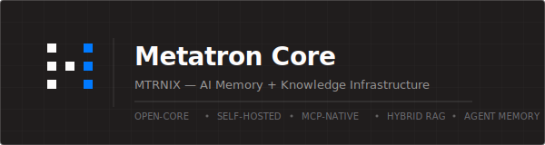

<p align="center">
  
</p>

<p align="center">
  <strong>Open-source AI memory infrastructure.</strong><br>
  Hybrid RAG, durable agent memory, MCP tools, and local-model support.
</p>

<p align="center">
  <a href="#install"><strong>Install</strong></a> |
  <a href="#choose-your-runtime-guide">Runtime Guides</a> |
  <a href="#quick-reference">Quick Reference</a> |
  <a href="#documentation">Docs</a>
</p>

---

## What This Is

Metatron Core is a self-hosted backend for AI agents and chat clients:

- ingest company knowledge from files and connectors
- query it through MCP, REST, or an OpenAI-compatible API
- store durable agent memory with workspace and agent scoping
- run on your own infra with Ollama or external model providers

If you just want to get it running, skip the theory and go straight to install.

---

## Install

### 1. Clone

```bash
git clone -b develop https://github.com/mtrnix/metatroncore.git
cd metatroncore
```

### 2. Verify Docker

```bash
docker --version
docker compose version 2>/dev/null || docker-compose --version
docker info >/dev/null 2>&1 && echo "daemon OK" || echo "START DOCKER DAEMON"
```

Install Docker if needed:

- macOS: <https://docs.docker.com/desktop/setup/install/mac-install/>
- Linux: <https://docs.docker.com/engine/install/>
- Windows: <https://docs.docker.com/desktop/setup/install/windows-install/>

### Sizing

Plan capacity before first boot:

| Item | Typical space |
|---|---|
| Docker images and build cache | `6-8 GB` |
| Postgres, Qdrant, Neo4j, Redis volumes | `2-4 GB` to start |
| Ollama models | `2-8 GB` depending on model size |
| Working headroom | `3-5 GB` |
| Recommended free disk before install | `15-20 GB` |

### Timing

Typical install timing on a modern laptop or dev server:

| Step | Typical time |
|---|---|
| Clone repo and create `.env` | `2-5 min` |
| First Docker image build | `5-15 min` |
| First container startup | `2-5 min` |
| First Ollama model pull | `3-20 min` depending on model size and network |
| Total first-time install | `12-45 min` |

After the first install, restarts are usually much faster unless you force a full rebuild.

Why Ollama is in the default stack:

- Metatron uses Ollama for local embeddings out of the box
- embeddings are what let Metatron index and retrieve your documents semantically
- the bundled setup also supports using Ollama for local chat models if you want

If you already run Ollama elsewhere, point Metatron at that host instead of using the
bundled container.

If Docker Desktop on macOS starts acting like it was raised by raccoons and `build`
fails with `permission denied`, run:

```bash
sudo chown -R $(whoami):staff ~/.docker
```

### 3. Create `.env`

```bash
cp .env.example .env
```

Pick one LLM provider.

DeepSeek:

```ini
LLM_PROVIDER=deepseek
DEEPSEEK_API_KEY=sk-your-deepseek-key
```

OpenRouter:

```ini
LLM_PROVIDER=openrouter
OPENROUTER_API_KEY=sk-or-your-openrouter-key
```

Built-in Ollama from the Compose stack:

```ini
LLM_PROVIDER=ollama
```

External Ollama host:

```ini
LLM_PROVIDER=ollama
OLLAMA_HOST=http://your-ollama-host:11434
```

Custom OpenAI-compatible provider:

```ini
LLM_PROVIDER=custom
CUSTOM_LLM_URL=https://your-llm-endpoint/v1
CUSTOM_LLM_API_KEY=your-key
```

Generate an MCP API key for agent runtimes:

```bash
openssl rand -hex 32
```

Add it to `.env`:

```ini
METATRON_MCP_API_KEY=<paste-the-generated-token>
```

### 4. Start the stack

Backend only:

```bash
docker compose -f docker-compose.full.yml up -d --build
```

Backend plus Open WebUI:

```bash
docker compose -f docker-compose.full.yml --profile openwebui up -d --build
```

First boot can take 10-15 minutes while images build and Ollama pulls models.

### 5. Verify

```bash
docker compose -f docker-compose.full.yml ps
curl http://localhost:8001/health
```

If health is up, the install worked.

---

## Choose Your Runtime Guide

After the backend is running, pick the client or runtime you actually want to use.

Priority guides:

- [Hermes Agent](docs/integrations/hermes-agent.md)
- [OpenClaw](docs/integrations/openclaw.md)
- [Ollama + GLM or Qwen](docs/integrations/ollama-local-models.md)
- [Claude Code](docs/integrations/claude-code.md)
- [Codex](docs/integrations/codex.md)
- [OpenCode](docs/integrations/opencode.md)
- [Pi](docs/integrations/pi.md)
- [LangChain](docs/integrations/langchain.md)
- [Python SDK](docs/integrations/sdk-python.md)
- [Go SDK](docs/integrations/sdk-go.md)
- [n8n](docs/integrations/n8n.md)
- [NanoClaw](docs/integrations/nanoclaw.md)
- [NanoBot](docs/integrations/nanobot.md)
- [Atomic Chat / Open WebUI + Ollama](docs/integrations/atomic-chat.md)

Generic MCP setup prompt:

- [Connecting To An Agent](connecting_to_agent.md)

---

## Quick Reference

External ports from `docker-compose.full.yml`:

| Service | Port |
|---|---|
| API | `8001` |
| PostgreSQL | `5433` |
| Qdrant HTTP | `6335` |
| Qdrant gRPC | `6336` |
| Neo4j HTTP | `7475` |
| Neo4j bolt | `7688` |
| Redis | `6380` |
| Ollama | `11435` |
| SPLADE | `8080` |
| Embedding proxy | `8002` |
| Open WebUI | `3080` |

Important URLs:

| Surface | URL |
|---|---|
| Health | `http://localhost:8001/health` |
| REST API | `http://localhost:8001/api/v1` |
| MCP | `http://localhost:8001/mcp` |
| OpenAI-compatible API | `http://localhost:8001/v1` |
| Open WebUI | `http://localhost:3080` |

Useful commands:

```bash
docker compose -f docker-compose.full.yml logs metatron-core
docker compose -f docker-compose.full.yml down
docker compose -f docker-compose.full.yml up -d --build --force-recreate
```

---

## Documentation

- [manual.md](manual.md) - short install walkthrough
- [install.md](install.md) - detailed install and troubleshooting
- [docs/README.md](docs/README.md) - documentation index
- [docs/MCP_API.md](docs/MCP_API.md) - MCP tool reference
- [docs/API.md](docs/API.md) - REST and OpenAI-compatible API reference

---

## Contributing

Bug reports, docs fixes, connector additions, and focused pull requests are welcome.

See [CONTRIBUTING.md](CONTRIBUTING.md).

---

## License

Apache License 2.0. See [LICENSE](LICENSE).
