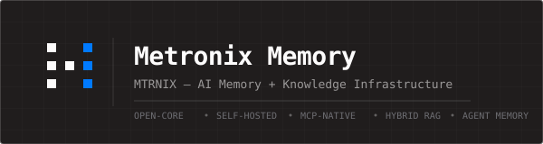
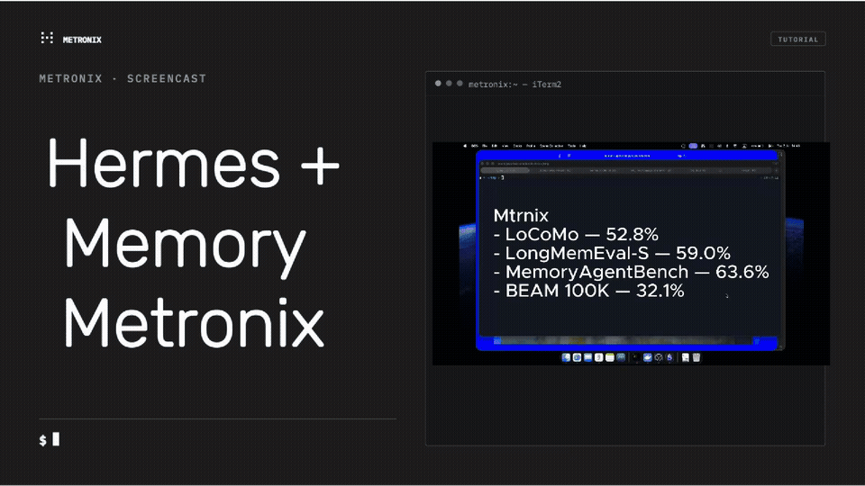

# Metronix Memory

<p align="center">
  
</p>

**Self-hosted AI agent memory — an MCP memory server with durable recall, hybrid RAG, and Neo4j graph context.**

Metronix is self-hosted memory infrastructure for AI agents: ingest files and SaaS knowledge, retrieve with dense + sparse + graph context, store durable facts and preferences per agent, and keep long-lived knowledge fresh as projects change.

<p align="center">
  
  
  
  
</p>

## What you get

- **Durable memory for every agent** — facts, preferences, and pinned context with workspace and agent scoping
- **Hybrid knowledge retrieval** — dense + SPLADE sparse + Neo4j graph context, with source citations
- **Self-hosted control** — Docker Compose stack, bundled local models, optional external answer generation
- **One integration surface** — MCP memory server today; REST and OpenAI-compatible APIs when you need them

## Quick start

Requirements: Docker with **≥6 GB RAM** (8 GB recommended) and ~15 GB free disk.

```bash
# One-liner (latest tagged release)
curl -fsSL https://mtrnix.com/install.sh | bash

# Or clone and install
git clone https://github.com/mtrnix/metronix-memory.git
cd metronix-memory
./install.sh                              # agent memory (default)
# ./install.sh --mode answers --openwebui -y   # optional chat UI + answers
curl http://localhost:8000/health
# {"status":"ok"}
```

Then connect an agent: **[Connecting to an agent](connecting_to_agent.md)**.

Full install (prerequisites, `.env`, ports, troubleshooting): **[install.md](install.md)**.

**⭐ Star us if you build agents that remember.**

<p align="center">
  
</p>

## Why Metronix

| Option | What it gives you | What Metronix adds |
| --- | --- | --- |
| Vector DB | Similarity search | Ingestion, MCP tools, durable agent memory, sparse + graph retrieval |
| Long context | More tokens in one prompt | Persistent memory across sessions, scoping, freshness |
| Chat history | Transcript recall | Structured facts/preferences, temporal knowledge, reusable MCP context |
| RAG framework | Building blocks | Operational backend: connectors, APIs, MCP, memory lifecycle |

## Benchmarks

Headline gate: **LongMemEval-S Recall@10 95.4%** under `benchmark-protocol v1.0` (directional N=1; same answer model, same blind judge).

| Benchmark | Scope | Layer B | Retrieval / signal | Status |
| --- | --- | --- | --- | --- |
| LoCoMo | 1,986 QA in the pinned dataset¹ | **52.8%** | Recall@10 **85.3%** | directional, results not committed in this repo · [harness](benchmarks/locomo) |
| LongMemEval-S | 500 questions | **59.0%** | Recall@10 **95.4%** | directional, results not committed in this repo · [harness](benchmarks/longmemeval) |
| MemoryAgentBench | 2,800 tasks | **63.6%** | Accurate Retrieval **84.7%** · EventQA blended **86.8%** | external, not reproduced in this repo |
| EventQA | MAB 65K + 131K | **86.8%** blended | 98.0% @ 65K · 94.8% @ 131K | external, not reproduced in this repo |
| BEAM 100K | 400 questions | **32.1%** | Recall@10 2.9% · Layer B is the meaningful figure | external, not reproduced in this repo |

Pattern: retrieval usually finds the evidence; answer synthesis and preference following remain the hard part. Details: [docs/benchmarks/longmemeval.md](docs/benchmarks/longmemeval.md).

*Directional* = single run (N=1); the run files, manifests and the `benchmark-protocol v1.0` text are not in this repository, so these numbers cannot be checked from it. *External* = no harness in this repository.

¹ `locomo10.json` at upstream commit `3eb6f2c`, SHA-256 as pinned in [benchmarks/locomo/README.md](benchmarks/locomo/README.md): 1,986 questions in 10 conversations; categories 1–4 (the harness default) = 1,540, category 5 (abstention) = 446. This table previously said 1,982, which does not match the file; which subset produced 52.8% / 85.3% is not recorded in this repository.

### Retrieval (passage recall@5), reproducible

Multi-hop passage retrieval on the HippoRAG evaluation sets. Per-question results are committed in [`benchmarks/musique/results/2026-09-27/`](benchmarks/musique/results/2026-09-27/); the values below are recomputed from those files.

| Configuration | MuSiQue R@5 (500 held-out) | 2Wiki R@5 (1,000) |
| --- | --- | --- |
| Production defaults (BFS graph channel, `signal` fusion) | 58.25 | 71.85 |
| Opt-in learned "ppr+" (PPR channel + learned fusion) | 62.80 | 85.65 |

Caveats:

- "ppr+" and the learned fusion are **off by default** (`METRONIX_RETRIEVAL_GRAPH_PPR_ENABLED=false`, `METRONIX_RETRIEVAL_FUSION_MODE=signal`).
- This measures **retrieval recall**, not answer accuracy: no EM/F1 was run.
- The MuSiQue graph is the **ready-made OpenIE graph released by HippoRAG (extracted by Llama-3.3-70B)**, not one built by Metronix's own extractor. A graph extracted by Metronix itself (`qwen2.5:3b`) was measured only on a 30-question MuSiQue slice: it is much sparser (the PPR channel alone reaches the last-hop passage for 9 of 30 questions vs 29 of 30 on an oracle graph, [REPORT](benchmarks/musique/REPORT.md) item 7), and learned "ppr+" is +13.3 R@5 over production there with a 95% CI of 3.3 to 23.3 ([research note](benchmarks/musique/findings/2026-09-26-fusion-research-note.md) §5.10). That slice is too small to size the gain on graphs Metronix extracts itself.
- The 2Wiki title-mention graph **structurally favours the gold passages**, so the 2Wiki gain is optimistic.
- The learned fusion was fitted on the other 500 MuSiQue questions; single run on CPU.
- Both configurations are **below HippoRAG 2** (74.7 / 90.4 as quoted in the [research note](benchmarks/musique/findings/2026-09-26-fusion-research-note.md) §5.8) and below plain NV-Embed-v2 on MuSiQue. Not a state-of-the-art claim.

Commands and verification: [docs/benchmarks/multihop-retrieval.md](docs/benchmarks/multihop-retrieval.md).

## Connect an agent

| Runtime | Guide |
| --- | --- |
| Any MCP client | [Connecting to an agent](connecting_to_agent.md) · [prompts.md](prompts.md) |
| Hermes | [Native provider](https://github.com/mtrnix/hermes-memory-metronix) · [MCP guide](docs/integrations/hermes-agent.md) |
| Cursor | [Cursor](docs/integrations/cursor.md) |
| Claude Desktop / Code | [Desktop](docs/integrations/claude-desktop.md) · [Code](docs/integrations/claude-code.md) |
| OpenCode · Codex · OpenClaw | [OpenCode](docs/integrations/opencode.md) · [Codex](docs/integrations/codex.md) · [OpenClaw](docs/integrations/openclaw.md) |
| LangChain · LangGraph · LlamaIndex | [LangChain](docs/integrations/langchain.md) · [LangGraph](docs/integrations/langgraph.md) · [LlamaIndex](docs/integrations/llamaindex.md) |
| SDKs · n8n | [Python](docs/integrations/sdk-python.md) · [Go](docs/integrations/sdk-go.md) · [n8n](docs/integrations/n8n.md) |

Full index: [docs/README.md](docs/README.md).

## Architecture

One-way layers — each level only imports downward:

```text
L6  api/            REST + OpenAI-compatible API + MCP HTTP mount
L5  channels/       Legacy Telegram, Discord, Slack integrations
L4  agent/          Intent router and compatibility shims
L3  services/       Connectors, LLM, MCP, memory, auth, workspaces, knowledge
L2  processing/     Ingestion, retrieval, freshness pipeline
L1  storage/        PostgreSQL, Qdrant, Neo4j, Redis clients
L0  core/           Config, models, events, plugin interfaces
```

| Pipeline | What it does |
| --- | --- |
| **Ingestion** | Fetch → parse → chunk → embed → store (connectors + files) |
| **Retrieval** | Classify → expand → recall → rerank → score → answer (dense + sparse + graph) |
| **Freshness** | Detect stale or conflicting memory and knowledge |
| **Memory** | Store → search → review → assemble (workspace / agent scoped) |

Interactive diagram (offline): [docs/architecture-diagram.html](docs/architecture-diagram.html).

## Admin console (optional)

Open-source web UI for connectors, uploads, channels, and health — presentation-only over the REST API:

```bash
docker compose --profile admin up -d --build   # → https://localhost:3000
```

Details: [frontend/README.md](frontend/README.md). The broader Control Center product is separate and not in this repo.

## Documentation

| Doc | Purpose |
| --- | --- |
| [install.md](install.md) | Full install, ports, troubleshooting |
| [connecting_to_agent.md](connecting_to_agent.md) | MCP setup for any agent |
| [prompts.md](prompts.md) | Paste-ready agent setup prompts |
| [docs/MCP_API.md](docs/MCP_API.md) | MCP tool reference |
| [docs/API.md](docs/API.md) | REST API reference |
| [docs/README.md](docs/README.md) | Documentation index |
| [CONTRIBUTING.md](CONTRIBUTING.md) | How to contribute |

## Development

```bash
make dev              # uvicorn --reload
make test             # pytest unit tests
make lint             # ruff check + format check
make typecheck        # mypy src/metronix/
make migrate          # alembic upgrade head
```

## FAQ

**Is Metronix hosted?**  
No — it is self-hosted. You run the backend and choose where data lives.

**Can multiple agents share one backend without leaking memory?**  
Yes. Memory is scoped by workspace and `agent_id`. Share a workspace for org knowledge; keep private memory per agent.

**Is this for Raspberry Pi or zero-latency voice loops?**  
No. Metronix is a server-side backend. Run it on a machine with enough RAM, and have edge clients connect over REST/MCP.

**Native Hermes provider vs MCP?**  
Use the [native provider](https://github.com/mtrnix/hermes-memory-metronix) for automatic prefetch/write-through; use MCP for explicit knowledge-base tools. They complement each other — see [Hermes MCP guide](docs/integrations/hermes-agent.md).

**How does MCP authentication work?**  
Local/self-hosted defaults use `AUTH_ENABLED=false` with `METRONIX_MCP_API_KEY`. Hosted deployments with `AUTH_ENABLED=true` require a user JWT instead — see [install.md](install.md) and [connecting_to_agent.md](connecting_to_agent.md).

**How do I verify memory actually works?**  
Store a distinctive record, then search via REST or `metronix_memory_search`. Do not rely only on asking an LLM “do you remember X?” — see [install.md](install.md) verify steps and [connecting_to_agent.md](connecting_to_agent.md).

## Contributing & support

Bug reports and PRs welcome — see [CONTRIBUTING.md](CONTRIBUTING.md).  
Issues: [github.com/mtrnix/metronix-memory/issues](https://github.com/mtrnix/metronix-memory/issues).

## License

Apache License 2.0. See [LICENSE](LICENSE).
