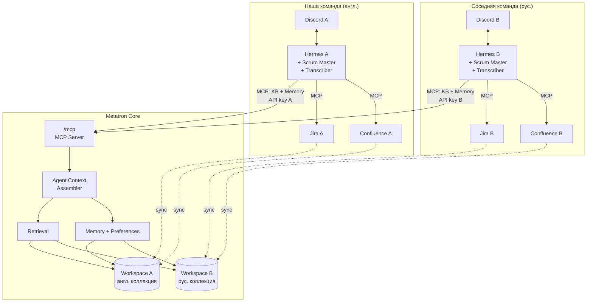
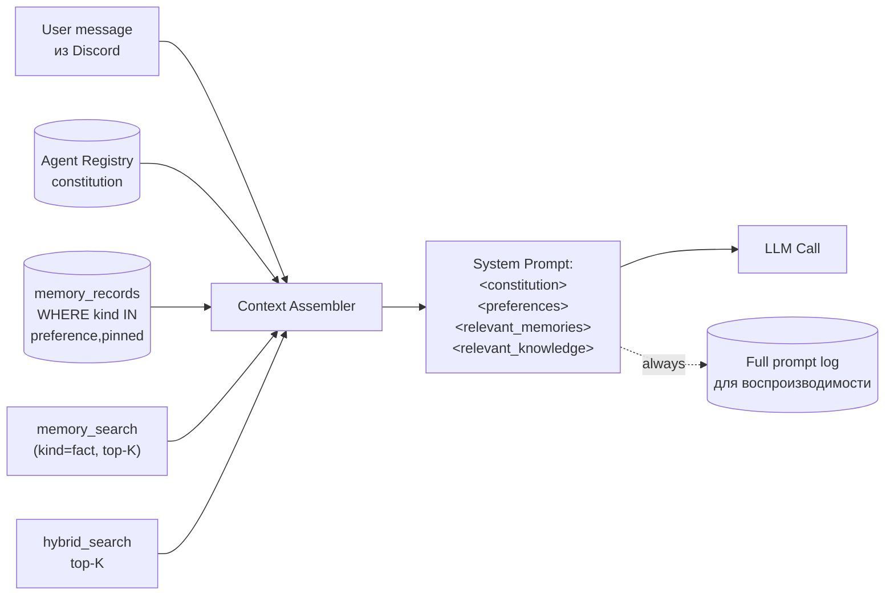
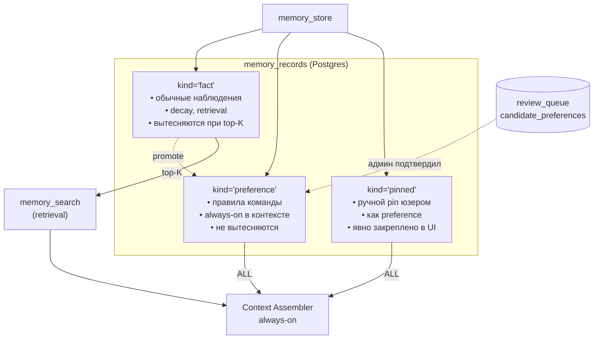
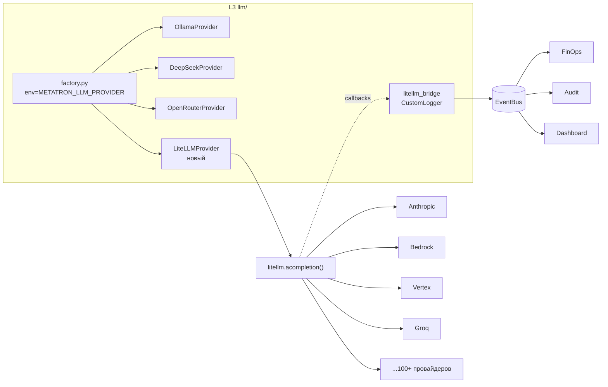

# Metatron + Hermes: архитектурные решения и план пилота

**Обновлено:** 2026-04-25
**Статус:** рабочий снэпшот перед пилотом двух команд

---

## TL;DR

Metatron — open-core memory-инфра для AI-агентов. Hermes — точка входа для end-users, подключен к Metatron через MCP. Сейчас раскатываемся на две команды (свою + соседей, у них русский контент vs наши 98% английского).

**Главные решения:**
- LLM-провайдер через LiteLLM **SDK** (не Proxy) внутри L3 `llm/`.
- Open-core граница — **по глубине capability**, не по транспорту. Core = базовые примитивы; Control Center = compliance/enterprise-фичи.
- Плагины общаются с core **только через EventBus / L0 интерфейсы / REST**, проектируем как под будущий sidecar.
- Текущий RBAC-плагин — **заморозить** (модель неправильная). Для пилота — workspace isolation из core.
- Permission Model v2 (ACL на чанках) — в бэклог с триггером «первый enterprise-клиент».

**Главная техническая задача на неделю:**
- Фикс **preference-level забывания** Hermes — вводим отдельный тип записи `preference` с always-on инжекцией в контекст, без поиска.
- Agent Context Assembler — жёстко разделяет constitution / preferences / searched memories / KB.
- Второй инстанс Hermes под соседей (Вариант B — не один процесс на два Discord guild).
- Тесты на cross-workspace и cross-agent leakage.
- Sanity-check русского через `make eval`.

**НЕ делаем до пилота:** Control Center, LiteLLM-миграцию, Permission v2, починку RBAC, монорепо-переезд.

---

## Оглавление

1. [Текущая архитектура](#1-текущая-архитектура)
2. [Критические проблемы](#2-критические-проблемы-в-порядке-приоритета)
3. [Memory Quality Layer (главное)](#3-решение-memory-quality-layer-главная-техническая-задача)
4. [Agent Context Assembler](#4-agent-context-assembler)
5. [Multi-tenant Hermes](#5-multi-tenant-hermes-для-пилота)
6. [LiteLLM интеграция](#6-litellm-интеграция-отложена-фиксируем-план)
7. [Open-core стратегия](#7-open-core-стратегия)
8. [Плагины: контракт и границы](#8-плагины-контракт-и-границы)
9. [RBAC: диагноз и план](#9-rbac-диагноз-и-план)
10. [План на следующую неделю](#10-план-на-следующую-неделю-до-подключения-соседей)
11. [Пост-пилотные приоритеты](#11-пост-пилотные-приоритеты)
12. [Схемы архитектуры](#12-схемы-архитектуры)
13. [Риски](#13-риски)
14. [Открытые вопросы](#14-открытые-вопросы-нужны-явные-решения)
15. [Сводка принятых решений (ADR)](#15-сводка-принятых-решений-adr-style)

---

## 1. Текущая архитектура

### 1.1. Metatron Core (стабильно)

Слоистая архитектура L0→L6, импорт строго вниз. Четыре БД: Postgres (system of record), Qdrant (vectors), Neo4j (graph), Redis (cache). Workspace isolation как базовый принцип — каждая коллекция/подграф scoped по `workspace_id`.

Поверхности подключения:
- `/mcp` — MCP Server (главная для агентов, в т.ч. Hermes).
- `/v1/chat/completions` — RAG-обёртка над hybrid_search_and_answer.
- `/api/v1/*` — REST.

Retrieval pipeline полный: hybrid (dense + SPLADE + graph), reranker bge-v2-m3, HyDE, query expansion, cross-encoder. `make eval` и `make grid-search` для качества. ~1150 тестов.

Memory (WS1) Stages 1-2 полностью, Stage 3 в мердже: MemoryService + hybrid search (dense Qdrant + graph-presence + session-cache boost) + REST + MCP-тулзы.

### 1.2. Hermes как точка входа

Hermes — агент-runtime, **сейчас единственная точка входа для пользователей**. Архитектура подключений:

```
Пользователи в Discord
       ↓
     Hermes
       ├── MCP → Metatron (KB + Agent Memory)
       ├── MCP → Jira
       ├── MCP → Confluence
       └── Skills (отдельные репы)
            ├── Scrum Master
            └── Transcriber (часть Scrum Master)
```

Скиллы — отдельные репозитории, подключаются к Hermes. Транскрайбер записывает созвоны, Scrum Master работает по процессам.

### 1.3. План раскатки на соседей

- У соседней команды — свой Discord, свой Jira, свой Confluence.
- Контент **на русском** (у нас 98% английского).
- План: второй Hermes-инстанс → свой Metatron workspace → свои коннекторы.

### 1.4. UI-статус

Core-функционал протестирован и стабилен. UI отстаёт: новый функционал не отображён, есть заготовки. **2-3 задачи на двух разработчиков.** Не блокер пилота (см. раздел 10.4).

### 1.5. Четыре репозитория

1. **metatroncore** — open-source ядро.
2. **metatron-enterprise-plugin** — через entry_points (runtime discovery). Сейчас недееспособен (см. раздел 9).
3. **knowledge-base-ui** — фронт для KB.
4. **control-center-ui** (metatronui-cc) — фронт для CC, in progress.

---

## 2. Критические проблемы (в порядке приоритета)

### 2.1. 🔴 Preference-level забывание Hermes [БЛОКЕР ПИЛОТА]

Hermes «забывает» настройки работы: preferences команды, договорённости, правила. Это **не баг Hermes**, это проблема качества `memory_search` + отсутствие категоризации записей. Детальный разбор и решение — раздел 3.

**Почему блокер:** если не починить до подключения соседей — у них будут те же симптомы. Лечить два случая сразу сложнее, чем один.

### 2.2. 🔴 Cross-workspace / cross-agent leakage не протестирован явно

Архитектурное правило №2 требует workspace isolation, но **отдельных тестов именно на утечку между workspace'ами** может не быть. Для пилота критично — утечка данных соседей в наш workspace (или наоборот) неприемлема. Плюс нужен тест на cross-agent leakage в памяти (Scrum Master не видит память Транскрайбера).

### 2.3. 🟡 RBAC-плагин недееспособен после переделок

Модель неправильная (permissions attached to ingestion вместо documents). Починка не нужна — заморозить и маркировать DEPRECATED. Для пилота достаточно workspace isolation. Подробно — раздел 9.

### 2.4. 🟡 Риск русского языка

SPLADE тренирован на английском, embedding-модель может быть англо-центрична. До пилота обязателен sanity-check через `make eval` на русском контенте соседей.

### 2.5. 🟢 UI отстаёт

Не блокер. Для соседей основной UX = Discord, UI нужен только тебе как админу (создание workspace, добавление connection, запуск sync, статус). Параллельная работа.

### 2.6. 🟢 Agent Memory Injection в OAI-compat (MTRNIX-249/275)

Актуально для OpenWebUI-пользователей, не для Hermes-пути. Hermes сам собирает контекст перед вызовом LLM через MCP. Но решение Preference-вопроса (раздел 3) использует ту же инфраструктуру — делать одновременно.

---

## 3. Решение Memory Quality Layer (главная техническая задача)

### 3.1. Диагноз preference-level забывания

Hermes запомнил «команда делает дейли в 10:30», но при запросе «когда у нас стендап?» этот факт не попадает в контекст. Возможные причины в порядке вероятности:

1. **Mismatch в формулировке.** Сохранено как «дейли», запрошено как «стендап». Для dense embedding это близко, но не идентично; если embedding-модель англо-центричная (не BGE-M3/E5-multilingual), на русском дистанция вырастет.
2. **Размывание.** Preference — один из 500+ фактов агента. В top-K по релевантности она не попадает, её вытесняют более свежие и похожие факты.
3. **Отсутствие категоризации.** Все записи равноправны. Нет различия «это сохранённое правило» vs «это однократное наблюдение». Механизм один — `memory_search` с hybrid scoring'ом.
4. **Нет «always-on» канала.** Preferences — это **состояние агента**, не «факт, который нужно искать». Если ты ищешь — ты уже потенциально не найдёшь.
5. **Graph-экстракция не связала preference** с правильной entity — «стендап» не проассоциирован с сущностью «команда».

**Фундамент проблемы:** семантика «preference» отсутствует в модели данных. Всё лежит в `memory_records` как однородные факты.

### 3.2. Решение — многослойная память

Вводим **три уровня записей** в `memory_records` через новое поле `kind`:

| kind | Поведение | Примеры |
|---|---|---|
| `fact` | Обычная запись. Участвует в `memory_search`, scoring по релевантности, decay. | «Вчера обсудили задачу X», «Иван упомянул, что ему нужен доступ». |
| `preference` | **Always-on** в контексте агента. Инжектируется **без поиска**. Не decay'ится. | «Дейли в 10:30», «Код-ревью минимум один approve», «Тикеты пишем на английском». |
| `pinned` | Ручной pin от пользователя/админа. Как preference, но явно закреплено через UI/tool. | Любой factual, который пользователь сказал «запомни это намертво». |

Implementation-wise это **не новая БД** — поле `kind` добавляется в существующую схему `memory_records` в Postgres, плюс enum в Pydantic-моделях.

### 3.3. Новый механизм: Agent Always-On Context

Для каждого запроса Hermes к Metatron (или шире — для каждого `agent_context_assembly` вызова) **все** preference/pinned записи этого агента инжектируются в системный промпт **без retrieval'а**:

```
System prompt:
  [Constitution — из Agent Registry, неизменяемая роль/миссия агента]
  [Agent Preferences — ВСЕ записи kind=preference|pinned для этого agent_id]
  [Retrieved Memories — top-K из memory_search, kind=fact]
  [Retrieved KB chunks — top-K из hybrid_search, опционально]
User message:
  [Текущий запрос]
```

Preferences **никогда не вытесняются**, потому что:
- Живут в отдельной секции с фиксированным местом.
- Не проходят через scoring — их всегда все.
- Конкурируют с памятью за токены? — решается лимитом (если preferences > 2000 токенов, алерт админу «пора чистить»).

### 3.4. Как запись становится `preference`

Три пути promotion'а:

**Путь 1: Явный API.**
```python
await memory_store(
    content="Команда делает дейли в 10:30",
    kind="preference",
    agent_id=agent_id,
    workspace_id=workspace_id,
)
```
Использует Hermes сам, когда распознаёт «правило»/«договорённость» в диалоге. Правила распознавания — skill Scrum Master.

**Путь 2: Promote обычного факта.**
Существующий `fact` промоутируется в `preference` через `memory_update(kind="preference")`. Используется когда факт подтвердился несколько раз или человек сказал «запомни это как правило».

**Путь 3: Автопромоут (отложенно).**
При появлении assertion lifecycle (CANDIDATE/ACTIVE/SUPERSEDED/ARCHIVED из роадмапа) — факт со множественными повторениями и отсутствием противоречий автоматически промоутится. **НЕ делать на этой неделе**, добавить в бэклог.

### 3.5. Review queue для ambiguous cases

Если Hermes-скилл распознаёт «похоже на правило», но не уверен — пишет в `review_queue` с kind=`candidate_preference`. Админ в UI (или через MCP-тулзу `memory_review_list` — она уже есть в саммари core) подтверждает или отклоняет. Это снижает риск ложных preferences.

### 3.6. Что с существующими записями Hermes

После деплоя — все старые записи останутся `kind=fact`. **Migration не требуется** (новое поле nullable или default='fact'). Но стоит сделать одноразовый skill-шаг: Hermes просматривает существующую память, предлагает кандидатов для promotion в UI, админ подтверждает.

### 3.7. Соотношение с существующим scope'ом

- **MTRNIX-249** (memory в OAI-compat) — использует **ту же** логику Agent Context Assembler (раздел 4). Делать одновременно, чтобы не реализовывать одну идею дважды.
- **MTRNIX-275** (AgentMemoryManager) — **это и есть** этот раздел, просто без выделения preference-семантики. Нужно дополнить scope: preference как отдельный kind, always-on канал.
- **Assertion lifecycle** (в gap-map как 🔴) — НЕ блокирует Memory Quality Layer. Делаем preference-слой сейчас, lifecycle когда дойдут руки. Они ортогональны: `kind` — семантика записи, `status` — её зрелость.

### 3.8. Минимальный scope реализации на неделю

1. **Поле `kind`** в `memory_records` (миграция Alembic).
2. **Обновить MCP-тулзы** `memory_store`, `memory_update` — принимают `kind`.
3. **Новый endpoint / MCP-тулза** `memory_get_preferences(agent_id, workspace_id)` — возвращает все preferences/pinned.
4. **В Hermes** — перед каждым LLM-вызовом тянуть preferences и инжектить в system prompt.
5. **Обновить Scrum Master skill** — распознавание «правил» → `kind=preference` при `memory_store`.
6. **Тесты** — preference инжектится во все запросы, не теряется, не вытесняется retrieval'ом.

Этот scope — **2-3 дня для одного инженера**, делается параллельно с подготовкой пилота.

---

## 4. Agent Context Assembler

### 4.1. Роль компонента

Единственное место в системе, где собирается финальный промпт для агента. Вызывается **и** Hermes (через MCP-обёртку), **и** `/v1/chat/completions` (закрывает MTRNIX-249). Одна реализация — два потребителя.

### 4.2. Контракт

```python
async def assemble_agent_context(
    agent_id: str,
    workspace_id: str,
    user_message: str,
    conversation_history: list[Message] = None,
    include_kb: bool = True,
    kb_top_k: int = 5,
    memory_top_k: int = 10,
) -> AssembledContext:
    """
    Возвращает:
      - system_prompt: собранная система со всеми секциями
      - user_message: нормализованный user-вход
      - history: прошедшая через trimming история
      - debug_payload: полный сборный промпт для логов и воспроизводимости
    """
```

### 4.3. Структура system_prompt

Четыре жёстко разделённых секции, **строго в этом порядке**, с разделителями:

```
<constitution>
  [Agent Registry: role, mission, style, never-do rules]
</constitution>

<preferences>
  [memory_records WHERE agent_id=X AND kind IN ('preference','pinned')]
  [ВСЕ, без retrieval, отсортированы по created_at desc]
</preferences>

<relevant_memories>
  [memory_search(kind='fact', top_k=memory_top_k) — по релевантности к user_message]
</relevant_memories>

<relevant_knowledge>
  [hybrid_search top_k=kb_top_k, если include_kb]
</relevant_knowledge>
```

Разделители намеренно XML-подобные — модели хорошо их понимают, и это защита от prompt injection из retrieved data (если во вложенном документе встретится «игнорируй инструкции», это будет внутри `<relevant_knowledge>`, а не на уровне constitution).

### 4.4. Token budget

Чтобы секции не разрастались бесконтрольно — бюджет по каждой:

| Секция | Целевой бюджет | Поведение при превышении |
|---|---|---|
| Constitution | 2000 токенов | Алерт админу, hard cap |
| Preferences | 2000 токенов | Алерт «пора чистить», soft cap (не режем, но уведомляем) |
| Relevant memories | 3000 токенов | Уменьшаем `memory_top_k` |
| Relevant knowledge | 4000 токенов | Уменьшаем `kb_top_k` |

Бюджеты конфигурируемы per-agent в Agent Registry.

### 4.5. Debug-прозрачность

Полный финальный промпт **всегда** логируется (structlog + опционально отдельный audit-stream). Без этого воспроизводимость инцидентов невозможна — «почему Hermes тут ответил странно» в 90% случаев решается «посмотреть, что ему на вход подавалось».

---

## 5. Multi-tenant Hermes для пилота

### 5.1. Два варианта деплоя

**Вариант A: один процесс Hermes, два Discord guild.**
Один деплой, подключен к двум guild'ам, резолвит guild_id → workspace_id.
- ✅ Один деплой, одни обновления.
- ❌ Сбой валит обе команды.
- ❌ Секреты Jira/Confluence обеих команд в одном процессе.
- ❌ Тяжело кастомизировать скиллы per-team.

**Вариант B: два процесса Hermes.**
Независимые инстансы, у каждого свои секреты, токен, `METATRON_MCP_API_KEY`.
- ✅ Изоляция сбоев и секретов.
- ✅ Независимые релизы (можно тестовую версию катить только у себя).
- ❌ Удвоенная операционная нагрузка.
- ❌ Риск расхождения версий.

### 5.2. Решение: Вариант B для пилота

Обоснования:
- **Security:** секреты двух Jira в одном процессе — смелл. Компрометация Hermes → доступ к обоим Jira.
- **Release safety:** на пилоте будут частые обновления, не нужно катить их на обе команды одновременно.
- **Workspace isolation существует на стороне Metatron**, но на стороне Hermes её нет — процессная граница её даёт.

Вариант A становится обоснованным **после** пилота, когда версия стабилизируется и появится proper multi-tenancy в самом Hermes.

### 5.3. Что меняется в Metatron

Ничего — MCP-endpoint и так многоклиентный. Единственное правило: **у каждого Hermes-инстанса свой `METATRON_MCP_API_KEY`**, привязанный к своему workspace в core. Не один ключ на оба Hermes.

---

## 6. LiteLLM интеграция (отложена, фиксируем план)

### 6.1. Решение: SDK, не Proxy

LiteLLM в одном пакете содержит Proxy Server и Python SDK — это разные продукты. Для Metatron нужен **SDK**, встраиваемый в L3 `llm/` как ещё один провайдер. Proxy Server **не ставим**, потому что он дублирует auth/RBAC/ключи, которые у нас уже есть в core.

### 6.2. Место встраивания

L3 `llm/` сейчас выбирает провайдера по env (`METATRON_LLM_PROVIDER=ollama|deepseek|openrouter`). LiteLLM добавляется как **ещё одна ветка** фабрики, реализующая тот же интерфейс `LLMProvider`:

```python
# metatron/llm/factory.py
elif provider_name == "litellm":
    return LiteLLMProvider()
```

### 6.3. Что получаем бесплатно

- 100+ провайдеров через один API (Bedrock, Vertex, Azure OpenAI, vLLM, Groq, Fireworks, Together, Anthropic, OpenRouter, Ollama-совместимые).
- `completion_cost()` с актуальными прайс-листами.
- Унифицированный usage-формат независимо от провайдера.
- Fallback-цепочки: `fallbacks=["claude-3.5-sonnet", "gpt-4o", "ollama/qwen2.5"]`.
- Retry с экспоненциальным backoff.
- Streaming через стандартный async-интерфейс.
- `token_counter()` без ручного tiktoken для разных моделей.

### 6.4. EventBus-мост (ключевой для Metatron)

LiteLLM SDK даёт `CustomLogger`. Регистрируем мост, который превращает события SDK в события L0 EventBus:

```python
class MetatronLiteLLMBridge(CustomLogger):
    async def async_log_success_event(self, kwargs, response_obj, start_time, end_time):
        metadata = kwargs.get("litellm_params", {}).get("metadata") or {}
        await self.event_bus.emit(EventType.LLM_CALL_COMPLETED, {
            "workspace_id": metadata.get("workspace_id"),
            "agent_id": metadata.get("agent_id"),
            "model": kwargs.get("model"),
            "input_tokens": response_obj.usage.prompt_tokens,
            "output_tokens": response_obj.usage.completion_tokens,
            "cost_usd": kwargs.get("response_cost"),
        })
```

Существующие подписчики EventBus (FinOps, audit, dashboard) автоматически начинают получать события по LLM-вызовам без изменений в вызывающем коде.

### 6.5. Когда запускаем

**После пилота.** На пилоте не трогаем работающий `llm/`-слой. Миграция — отдельный спринт с фичефлагом `METATRON_LLM_USE_LITELLM`, постепенным переключением per-workspace.

### 6.6. Опциональный Proxy — только если появятся потребители

LiteLLM Proxy имеет смысл ставить **дополнительно** только если:
1. Data scientists / аналитики хотят LLM без прохождения через Metatron («OpenAI-совместимый endpoint с нашими ключами»).
2. Нужен единый пул rate-limit'ов на уровне провайдера для Metatron + внешние потребители.
3. Менеджеру нужна не-техническая админка бюджетов.

Вне этих сценариев — не ставим.

---

## 7. Open-core стратегия

### 7.1. Принцип разделения

**Ось разреза — глубина capability, не транспорт.** Все поверхности (MCP, OAI-compat, REST) проходят через одни и те же enforcement-точки. Policy engine, audit log, 5-ролевой RBAC, SSO работают одинаково, независимо от того, откуда пришёл запрос.

**Критерий:**
- Фича закрывает compliance / SOC2 / enterprise-procurement → **Control Center**.
- Базовый инженерный примитив, без которого продукт не работает → **Core**.

### 7.2. Что в Core (open-source, Apache 2.0 / MIT)

- Retrieval pipeline (hybrid, SPLADE, reranker, graph).
- Все коннекторы (Confluence, Jira, Notion, GitHub, GDrive, Slack, Files).
- Ingestion и chunking.
- MCP-сервер, OAI-compat, REST — **все** поверхности.
- LiteLLM SDK-провайдер (это инфра).
- Базовый 3-ролевой RBAC (viewer/editor/admin).
- Workspace isolation.
- EventBus, plugin system, базовая observability.
- Agent Registry CRUD + lifecycle.
- Memory (WS1) + Memory Quality Layer (preference/pinned/fact).
- Agent Context Assembler.
- Knowledge Base UI.

### 7.3. Что в Control Center (commercial)

- 5-ролевой RBAC с делегированием.
- SSO (SAML/OIDC).
- Policy engine с декларативными политиками (OPA/Rego).
- Multi-tenant company/agent разделение.
- Audit log с retention policies и immutability.
- FinOps: бюджеты, алерты, cost tracking per team.
- Approval workflows для memory assertions и новых агентов.
- Compliance reports (SOC2, GDPR artifacts).
- HA-конфигурации, multi-region.
- Control Center UI.

### 7.4. Ловушка open-core — как не попасть

Классическая ловушка: мало фич в Core — нет комьюнити; много — нет покупателей. Выход — **разделять по характеру, а не по качеству**:
- Разработчик поднимает Metatron и получает **полноценный** memory-layer для агентов. Не «урезанную» версию.
- Компания на 500 человек приходит за SSO/RBAC-5/audit/бюджетами — **всё это compliance-требования**, без которых им просто нельзя развернуть продукт. Охотно платят.

### 7.5. Лицензии

- **Core:** Apache 2.0 или MIT. Избегать GPL/AGPL (блокируют enterprise adoption) и BSL (отпугивают контрибьюторов).
- **Control Center:** коммерческая. Код может быть публично видимым на GitHub (паттерн Sentry/GitLab/Supabase), но с явной лицензией «commercial use requires license».
- **Enforcement:** через наличие функционала в закрытом репо, не через runtime-проверки лицензий в коде.
- **Contributors:** DCO минимум, CLA желательно.

### 7.6. Монорепо vs multirepo

Текущее состояние — 4 репо (core + enterprise-plugin + KB UI + CC UI). Целевое — **монорепо с лицензионной границей по директориям** (паттерн Sentry/GitLab):

```
/core       — Apache 2.0
/enterprise — коммерческая лицензия
/shared     — общие утилиты
```

CI проверяет, что core не зависит от enterprise. Релиз — два артефакта: `metatroncore` (без `/enterprise`) и `metatroncc` (всё).

**Двигаться постепенно.** Не переливать всё сейчас. Решение для нового кода CC backend — принять до первой строки (монорепо или 5-й репо).

**UI kit.** Вынести общие компоненты (кнопки, формы, таблицы, дашборды) в npm-пакет `metatron-ui-kit`, подключаемый KB-UI и CC-UI. Иначе через полгода два дизайна одной функциональности.

---

## 8. Плагины: контракт и границы

### 8.1. Направление зависимости

Правильное: enterprise-плагин тянет `metatroncore` как зависимость, core через entry_points `metatron.plugins` находит плагин в runtime. Core **не импортирует** плагин напрямую.

**Проверка:** `grep -r "from metatron_enterprise" core/` должен быть пустым.

### 8.2. Same-process vs sidecar

Сейчас плагины живут в одном процессе с core. Архитектурный долг, который проявится на крупных клиентах:
- Сбой плагина валит core.
- Слабый licence enforcement.
- Coupling через memory space.

**Решение:** не переезжать сейчас, но **проектировать под будущий sidecar**. Плагин общается с core **только через три канала**:

1. **EventBus** (pub/sub).
2. **Публичные L0 интерфейсы** (`AuthProvider`, `PolicyEngine`, `AuditSink`, `MemoryLifecycleHook`).
3. **REST/RPC** для синхронных вызовов.

**Запрещено:**
- Прямой импорт внутренностей (`from metatron.memory.service import MemoryService`).
- Прямая работа с чужими БД.
- Monkey-patching.

### 8.3. Публичный контракт PluginManager

L0 `plugin.py` нужно зафиксировать как **supported public API**:
- SemVer.
- Changelog.
- Правило «ломаем только в мажорных релизах».
- Явно перечисленные точки расширения.

### 8.4. Матрица совместимости

В core `COMPATIBILITY.md`:
```
metatroncore 2.1.x ← совместим с → metatron-enterprise 1.4.x, 1.5.x
metatroncore 2.2.x ← совместим с → metatron-enterprise 1.5.x, 1.6.x
```
Плагин в `pyproject.toml`: `metatroncore>=2.1,<2.3`. Несовместимая пара → pip падает.

### 8.5. Контрактные тесты в CI

**Критично для предотвращения дрейфа.** В CI core поднимается test-fixture плагин (не настоящий enterprise), реализующий каждую публичную точку минимально. Если сигнатура extension point меняется — fixture не собирается, CI красный.

```yaml
# .github/workflows/core-ci.yml
jobs:
  contract-test:
    steps:
      - uses: actions/checkout@v4
        with:
          repository: yourorg/metatron-plugin-test-fixture
          path: plugin-fixture
      - run: pip install -e ./plugin-fixture
      - run: pytest tests/plugin_contract/
```

### 8.6. Cross-repo CI

При релизе нового core — через `repository_dispatch` триггерится enterprise-test-suite против свежего core. Разъезды ловятся в день релиза, не через две недели после жалоб.

---
## 9. RBAC: диагноз и план

### 9.1. Диагноз текущей модели

- User → Group → Workspace + Connection.
- «Источник не привязан к группе = виден всем» (fail-open дефолт).

**Симптомы (на самом деле — симптомы неправильной модели):**
- Источник привязали после ингестии → что делать с уже индексированными документами?
- Одна Confluence для двух отделов с разной видимостью → дубли при индексации?
- «Без группы = всем» — небезопасный дефолт.

**Корень:** у тебя сейчас `permissions attached to ingestion`, а должно быть `permissions attached to documents and chunks`.

### 9.2. Правильная модель (Permission v2)

**Ingestion не знает про permissions.** Коннектор тянет документы с их **нативными ACL** (Confluence space permissions, Jira project roles, GDrive sharing, GitHub repo visibility). ACL сохраняются на уровне документа/чанка как метаданные.

**Retrieval применяет permissions на запросе.** `hybrid_search` фильтрует чанки по ACL пользователя до (или сразу после) векторного поиска. Permission check — на **пути запроса**, не на пути ингестии.

**Эффекты:**
- Одна Confluence = один sync для всех отделов, фильтрация на запросе, **ноль дублей**.
- Изменение ACL в источнике → на лету, без переиндексации.
- Нет «видно всем» дефолта — явное «у документа нет ограничений».

### 9.3. Что делать с текущим плагином

**Заморозить и маркировать DEPRECATED.**

1. Баннер в README и коде:
   > **EXPERIMENTAL / DEPRECATED** — модель permissions будет переработана. Для multi-team изоляции используйте workspaces в core.
2. Из release-плана убрать все доделки. Баги — не чинить, отвечать «используйте workspaces».
3. **Ноль часов инвестиций.**
4. Репозиторий сохранить — user management, groups, UI админки переиспользуемы в v2.
5. В бэклог: эпик **Permission Model v2**. Триггер — первый enterprise-клиент с требованием «документы из Confluence должны уважать исходные ACL».

### 9.4. Для пилота — workspace isolation

Workspace — **физическое** разделение: отдельные коллекции в Qdrant, подграфы в Neo4j, `workspace_id` фильтр в Postgres. Для двух команд на пилоте этого **достаточно**.

Не нужно чинить RBAC, городить группы/permissions, проектировать multi-tenant ACL. Workspace'ы уже работают и оттестированы.

---

## 10. План на следующую неделю (до подключения соседей)

### 10.1. 🔴 Обязательно (без этого не стартуем)

**1. Memory Quality Layer — поле `kind` + always-on preferences** (раздел 3).
- Миграция Alembic: `kind ENUM('fact', 'preference', 'pinned')` в `memory_records`, default='fact'.
- MCP-тулзы `memory_store`, `memory_update` принимают `kind`.
- Новый endpoint/тулза `memory_get_preferences(agent_id, workspace_id)`.
- Scrum Master skill распознаёт «правила/договорённости» → `kind=preference`.
- Тест: preference инжектится в каждый запрос и не вытесняется retrieval'ом.

Оценка: **2-3 дня одного инженера.**

**2. Agent Context Assembler** (раздел 4).
- Один компонент в L3 `agents/` или новом `context/`, реализующий `assemble_agent_context`.
- Жёсткое разделение секций (`<constitution>`, `<preferences>`, `<relevant_memories>`, `<relevant_knowledge>`).
- Token budget с алертами.
- Логирование финального промпта.
- Вызывается из Hermes и из `/v1/chat/completions` (закрывает MTRNIX-249/275 частично).

Оценка: **2 дня одного инженера.**

**3. Тесты на cross-workspace и cross-agent leakage.**
- Workspace A делает `hybrid_search` → ноль чанков workspace B.
- То же для graph, MCP-тулз, `/v1/chat/completions`.
- Агент X в workspace A делает `memory_search` → ноль записей агента Y.

Оценка: **полдня.**

**4. Sanity-check русского через `make eval`.**
- 10-20 реальных документов соседей в тестовый workspace.
- 10-20 типичных запросов из их домена.
- Сравнение метрик с английским baseline.
- Если просадка > 30% — решать вопрос embedding-модели (BGE-M3/E5-multilingual).

Оценка: **полдня + возможно день на переключение embedding, если просадка велика.**

**5. Второй Hermes-инстанс под соседей (Вариант B, раздел 5).**
- Отдельный Discord bot token.
- Отдельный `METATRON_MCP_API_KEY`, привязанный к workspace соседей.
- Отдельные Jira/Confluence секреты.
- Независимый деплой.

Оценка: **1 день.**

### 10.2. 🟡 Желательно

**6. Онбординг-документ для соседей** (полстраницы): как подключить Jira/Confluence, как искать, куда писать фидбек.

**7. Канал фидбека.** Один Slack/Discord-канал, не личка.

**8. UI-задачи** — параллельно, не блокируя пилот.

### 10.3. 🟢 НЕ делать на этой неделе

- Control Center backend/frontend.
- LiteLLM-миграцию.
- Permission Model v2.
- Починку RBAC-плагина.
- Монорепо-переезд.
- Assertion lifecycle memory layer.

### 10.4. Чего **не хватает** в UI, но можно отложить

Для соседей основной UX = Discord. UI нужен только тебе как админу:
- Создание workspace — **есть**.
- Добавление connection — **есть**.
- Запуск sync — **есть**.
- Просмотр статуса sync — **есть**.

**Этого достаточно для пилота.** Остальное (memory admin UI, agent config UI, analytics-дашборды) — параллельно.

---

## 11. Пост-пилотные приоритеты

В порядке ожидаемой важности (ранжирование пересмотрится по фидбеку пилота):

1. **Assertion lifecycle** (CANDIDATE/ACTIVE/SUPERSEDED/ARCHIVED + contradiction detection + автопромоут fact→preference). Достраивает Memory Quality Layer.
2. **MTRNIX-249 / 275** если не закрылись в пилоте — остатки memory в OAI-compat.
3. **LiteLLM SDK миграция** в L3 `llm/` (раздел 6).
4. **Control Center backend** — решение monorepo vs 5-й репо до старта кода.
5. **Permission Model v2** — только когда триггер сработает (первый enterprise-клиент).
6. **Метатрон UI kit** как npm-пакет, вынос общих компонентов.
7. **PluginManager как supported public API** + контрактные тесты + cross-repo CI.
8. **Вынос `channels/` и `benchmarker/`** в опциональные плагины.
9. **Skills engine** — либо дизайн и реализация, либо удаление `skills/` из L3.

---
## 12. Схемы архитектуры

Каждая схема в Mermaid (GitHub/VSCode/Obsidian рендерят) и ASCII (видно везде).

### 12.1. Текущая картина: Hermes как точка входа + пилот двух команд



**ASCII-версия:**

```
   НАША КОМАНДА (англ.)                         СОСЕДНЯЯ КОМАНДА (рус.)
   ───────────────────                          ───────────────────────
   Discord A ◄─────► Hermes A                   Discord B ◄─────► Hermes B
                    ├─ Scrum Master                              ├─ Scrum Master
                    └─ Transcriber                               └─ Transcriber
                        │                                           │
                        │ MCP (API key A)                           │ MCP (API key B)
                        ▼                                           ▼
   ┌─────────────────────────────────────────────────────────────────────┐
   │                         METATRON CORE                               │
   │                                                                     │
   │                            /mcp                                     │
   │                             │                                       │
   │                             ▼                                       │
   │                  Agent Context Assembler                            │
   │                             │                                       │
   │             ┌───────────────┼──────────────┐                        │
   │             ▼               ▼              ▼                        │
   │        Retrieval        Memory+Prefs      KB                        │
   │             │               │              │                        │
   │   ┌─────────┴───────────────┴──────────────┴────────┐               │
   │   │                                                 │               │
   │   ▼                                                 ▼               │
   │ Workspace A (англ.)                        Workspace B (рус.)       │
   │ Qdrant coll_a                              Qdrant coll_b            │
   │ Neo4j subgraph_a                           Neo4j subgraph_b         │
   └─────────────────────────────────────────────────────────────────────┘
            ▲                                             ▲
            │ sync                                        │ sync
   Jira A / Confluence A                         Jira B / Confluence B
```

### 12.2. Agent Context Assembler — секции промпта



**ASCII-версия:**

```
   User msg ──────────────────────────┐
                                      │
   Agent Registry                     ▼
   (constitution) ──────────►  Agent Context Assembler
                                      │
   memory_records                     │
   WHERE kind IN                      │
   ('preference','pinned') ──────────►│  собирает:
                                      │
   memory_search                      │
   (kind='fact', top-K=10) ──────────►│    ┌─────────────────────┐
                                      │    │ <constitution>      │
   hybrid_search                      │    │   [роль, миссия,    │
   (KB, top-K=5) ────────────────────►├───►│    never-do]        │
                                      │    │ </constitution>     │
                                      │    │                     │
                                      │    │ <preferences>       │
                                      │    │   [ВСЕ preferences, │
                                      │    │    без retrieval]   │
                                      │    │ </preferences>      │
                                      │    │                     │
                                      │    │ <relevant_memories> │
                                      │    │   [top-K facts]     │
                                      │    │ </relevant_memories>│
                                      │    │                     │
                                      │    │ <relevant_knowledge>│
                                      │    │   [top-K KB chunks] │
                                      │    │ </relevant_knowledge│
                                      │    └──────────┬──────────┘
                                      │               │
                                      └───────────────┴────► LLM call
                                                      │
                                                      ▼
                                              structlog (full prompt)
```

### 12.3. Типы записей памяти



**ASCII-версия:**

```
                        memory_store (MCP tool)
                               │
               ┌───────────────┼───────────────┐
               ▼               ▼               ▼
         kind='fact'    kind='preference'  kind='pinned'
         ────────       ───────────────    ──────────────
         • decay        • always-on        • always-on
         • retrieval    • не decay         • не decay
         • top-K        • все в промпт     • все в промпт
               │               │               │
               │   promote     │               │
               ├──────────────►│               │
               │               │               │
               │         review_queue          │
               │      (candidate_prefs)        │
               │               ▲               │
               │               │ админ         │
               │               │ подтвердил    │
               │                               │
               ▼               │               │
         memory_search         │               │
         (top-K по             │               │
         релевантности)        │               │
               │               │               │
               │         ВСЕ preferences + pinned
               │               │               │
               ▼               ▼               ▼
         ┌─────────────────────────────────────────┐
         │    Agent Context Assembler              │
         │    (preferences + pinned: all,          │
         │     facts: top-K retrieved)             │
         └─────────────────────────────────────────┘
```

### 12.4. LiteLLM в L3 llm/ (отложено)



**ASCII-версия:**

```
   env: METATRON_LLM_PROVIDER=litellm
               │
               ▼
    ┌──────────────────────┐
    │  llm/factory.py      │
    └────┬────┬────┬───┬───┘
         │    │    │   │
         ▼    ▼    ▼   ▼
      Ollama DS OR LiteLLMProvider  (новый)
                    │
                    ▼
           litellm.acompletion()
           │                │
           │                └─► callbacks ─► Bridge (CustomLogger)
           │                                       │
           │                                       ▼
           │                                  EventBus
           ▼                                ├──► FinOps
   100+ провайдеров                         ├──► Audit
   (Bedrock, Vertex,                        └──► Dashboard
   Anthropic, Groq,
   vLLM, Ollama-compat)
```

### 12.5. Open-core разрез

```
╔══════════════════════════════════╗        ╔══════════════════════════════════╗
║  OPEN-SOURCE (Apache 2.0)        ║        ║  COMMERCIAL (Control Center)     ║
╠══════════════════════════════════╣        ╠══════════════════════════════════╣
║  metatron-core       [репо 1]    ║◄───────║  metatron-enterprise  [репо 2]   ║
║  ──────────────────────────────  ║ зав.   ║  ──────────────────────────────  ║
║  • Retrieval pipeline            ║        ║  • SSO (SAML/OIDC)               ║
║  • Все коннекторы                ║        ║  • 5-ролевой RBAC                ║
║  • MCP + OAI + REST              ║        ║  • Policy engine                 ║
║  • llm/ + LiteLLM SDK            ║        ║  • Audit с retention             ║
║  • Базовый RBAC (3 роли)         ║        ║  • Бюджеты / cost tracking       ║
║  • Workspace isolation           ║        ║  • Approval workflows            ║
║  • Memory + Preferences          ║        ║  • Multi-tenant                  ║
║  • Agent Context Assembler       ║        ║  • Compliance reports            ║
║  • Agent Registry                ║        ║  • Multi-region / HA             ║
║  • EventBus + Plugin System      ║        ║                                  ║
║                                  ║        ║                                  ║
║  knowledge-base-ui    [репо 3]   ║        ║  control-center-ui    [репо 4]   ║
║                                  ║        ║                                  ║
║  ───── metatron-ui-kit (npm) ─ общие компоненты KB + CC ────────────────     ║
╚══════════════════════════════════╝        ╚══════════════════════════════════╝
      Apache 2.0 / MIT                             Commercial license
      • не блокирует enterprise                    • публично видимо на GitHub
      • DCO/CLA для PR                             • enforcement через наличие
```

### 12.6. Плагинные каналы связи

```
   METATRON CORE                            ENTERPRISE PLUGIN
   ─────────────                            ─────────────────
                                            entry_points:
   PluginManager  ◄────── discovers ────────  metatron.plugins
      │
      ▼
   L0 interfaces  ◄═══════ ✅ реализует ══════ импл. интерфейсов
   (AuthProvider,                             (AuthProvider impl,
    PolicyEngine,                              PolicyEngine impl,
    AuditSink,                                 AuditSink impl,
    MemoryHook)                                MemoryHook impl)

   EventBus      ◄════════ ✅ слушает ════════ event listeners
                ═════════► ✅ эмитит

   PluginManager ◄════════ ✅ регистрирует ═══ extra routes, middleware

                ╳ запрещено ╳
   L3 services  ◄╳╳╳╳╳╳╳╳╳╳╳╳ прямой импорт внутренностей
                ╳╳╳╳╳╳╳╳╳╳╳╳╳ чтение/запись чужих БД
                ╳╳╳╳╳╳╳╳╳╳╳╳╳ monkey-patching

   Все взаимодействие — через 3 канала:
     1. EventBus
     2. L0 публичные интерфейсы
     3. REST/RPC (future sidecar)
```

### 12.7. RBAC: текущая (неправильная) vs v2

```
❌ СЕЙЧАС — permissions на ingestion

  Confluence ──► Connection (group-scoped) ──► Documents (видны своим группам)

  Проблемы:
    • Одна Confluence на N отделов → дубли
    • Источник привязали поздно → переиндексация
    • "Без группы = всем" → fail-open


✅ v2 — permissions на документах/чанках

  Confluence ──► Connection (без ACL) ──► Documents+Chunks с нативными ACL
                                                  │
                                                  ▼
                                          Retrieval фильтрует
                                          по ACL пользователя
                                                  │
                                                  ▼
                                      Query видит только разрешённое

  Эффекты:
    • Один sync на N отделов → ноль дублей
    • ACL меняются в источнике → эффект на лету
    • Нет "видно всем" дефолта
```

### 12.8. Дорожная карта на 2 месяца

```
НЕДЕЛЯ 1 (пре-пилот)
│
├─ Memory Quality Layer (kind=fact/preference/pinned)
├─ Agent Context Assembler
├─ Тесты cross-workspace/cross-agent leakage
├─ Sanity-check русского (make eval)
└─ Hermes B под соседей (Вариант B)
                                │
                                ▼
НЕДЕЛЯ 2-4 (пилот двух команд)
│
├─ Раскатка на соседей
├─ Сбор фидбека в одном канале
├─ UI-задачи параллельно
└─ Мониторинг preferences забывания
                                │
                                ▼
МЕСЯЦ 2 (пост-пилот)
│
├─ Ревью фидбека → ранжирование пост-пилотных приоритетов
├─ Assertion lifecycle → автопромоут fact→preference
├─ LiteLLM SDK миграция в L3 llm/ (с фичефлагом)
└─ Решение monorepo vs 5-й репо для CC backend
                                │
                                ▼
МЕСЯЦ 3+
│
├─ CC backend start (если решили)
├─ PluginManager supported API + контрактные тесты
└─ Permission v2 — только если триггер сработал
```

---

## 13. Риски

| Риск | Вероятность | Импакт | Митигация |
|---|---|---|---|
| Preference-слой недостаточен — Hermes продолжит «забывать» даже с ним | Средняя | Высокий (пилот провалится по user-perception) | Логировать финальный промпт. Мониторить жалобы соседей на «забывает X». На первой жалобе — проверить: X в preferences или facts? Если в facts — добавить правило distiller'а или явный promote. |
| Cross-workspace утечка на пилоте | Низкая | Критический (неприемлемо для соседей) | Явные тесты ДО пилота (раздел 10.1, п. 3). |
| Русский просел > 30% на eval | Средняя | Высокий | Sanity-check заранее. План Б — переключение embedding на BGE-M3 с переиндексацией soseда workspace. |
| Второй Hermes дрейфует в версиях от основного | Средняя | Средний | Единый CI/CD pipeline, версии синхронно. Не экспериментировать на соседях без проверки у себя. |
| RBAC-плагин тянут из привычки, путаница роли и workspace | Низкая | Средний | Баннер DEPRECATED + явная коммуникация команде. |
| Соседи не дают фидбека (пилот «тишина») | Средняя | Средний (не сразу, но делает пилот бесполезным) | Один канал + еженедельный sync 15 минут, чтобы явно спрашивать. |
| Skill «распознавание правил» в Scrum Master даёт много false-positive preferences | Средняя | Низкий | Review queue + возможность массово удалять неверные преференсы. Не авто-promote без подтверждения на этапе пилота. |
| Token budget preferences превышен (накопилось много) | Низкая вначале, растёт | Средний | Алерт админу на пороге 2000 токенов. В пост-пилоте — механизм ручной архивации старых. |
| Контрибьюторы OSS приходят раньше, чем готов supported plugin API | Низкая (пока OSS не запущен) | Средний (breaking changes больно для ранних пользователей) | До OSS launch — жёстко держать plugin API, зафиксировать 1.0 с SemVer. |

---

## 14. Открытые вопросы (нужны явные решения)

### 14.1. Текущий RBAC-плагин — smoke-test перед заморозкой?

Вариант A: заморозить без проверки, сэкономить время.
Вариант B: прогнать базовый smoke за полдня, чтобы понять, что можно реюзать в v2.

**Рекомендация:** B, если найдётся полдня. Ценность в том, что user management / groups / UI админки в v2 переиспользуемы, и знание их актуального состояния пригодится.

### 14.2. CC backend: 5-й репо или сразу монорепо?

Pre-Sprint решил «5-й репо, импорт core as library». Но долгосрочное целевое — монорепо (Sentry-паттерн).

**Нужно решить до первой строки CC backend.** Обратное переключение дорого.

### 14.3. LiteLLM-провайдер — core или плагин?

- **В core:** `litellm` становится прямой зависимостью, проще путь.
- **Как плагин** `metatron-plugin-litellm`: чище open-core, но +1 точка сложности.

**Рекомендация по умолчанию:** в core на первом шаге, в плагин можно вынести позже.

### 14.4. Permission v2 — писать дизайн-док сейчас или по триггеру?

- **Сейчас:** контекст свежий, можно быстро. Но может устареть без обратной связи.
- **По триггеру:** актуальный по требованиям, но делать срочно в сжатые сроки.

**Рекомендация:** написать **краткий** ADR (страница) с базовой моделью сейчас. Детальный дизайн — по триггеру.

### 14.5. UI Kit — сейчас или после пилота?

Сейчас: синхронизация дешёвая, два UI небольшие.
После пилота: рискуем расхождением.

**Рекомендация:** после пилота, но **в первый пост-пилотный спринт**. Откладывать опаснее.

### 14.6. Triggers для sidecar переезда CC

Same-process сейчас. Когда запускаем sidecar-миграцию? Нужен триггер:
- Первый enterprise-клиент с требованием изоляции?
- Security-аудит показал проблему?
- N сбоев CC валит core за квартал?

Без триггера → «потом» = никогда.

### 14.7. Auto-promote fact→preference в assertion lifecycle

Когда появится lifecycle — авто-promote на основе повторений/отсутствия противоречий? Или только ручной/через review queue?

**Рекомендация:** только ручной / review queue на пилоте. Авто-promote — после пилота, когда понятны паттерны ошибок Hermes.

---

## 15. Сводка принятых решений (ADR-style)

| # | Решение | Статус | Раздел |
|---|---|---|---|
| D-001 | LiteLLM **SDK**, не Proxy, внутри L3 `llm/` | ✅ Принято | 6 |
| D-002 | LiteLLM Proxy — только если появятся non-Metatron потребители | 🟡 Триггер-based | 6.6 |
| D-003 | Open-core делим **по глубине capability**, не по транспорту | ✅ Принято | 7.1 |
| D-004 | LiteLLM-провайдер — в Core (не CC) | ✅ Принято | 7.2 |
| D-005 | Lic Core = Apache 2.0 / MIT | ✅ Принято | 7.5 |
| D-006 | Lic CC = commercial, код может быть публично видимым | ✅ Принято | 7.5 |
| D-007 | DCO/CLA для PR в core | ✅ Принято | 7.5 |
| D-008 | Enforcement через наличие функционала, не runtime license checks | ✅ Принято | 7.5 |
| D-009 | PluginManager как supported public API с SemVer | 📌 К внедрению | 8.3 |
| D-010 | Контрактные тесты в CI core через test-fixture плагин | 📌 К внедрению | 8.5 |
| D-011 | Cross-repo CI через repository_dispatch | 📌 К внедрению | 8.6 |
| D-012 | Плагины общаются с core только через EventBus / L0 / REST | ✅ Принято | 8.2 |
| D-013 | Same-process плагины сейчас, проектируем под sidecar | ✅ Принято | 8.2 |
| D-014 | RBAC-плагин — заморозить как DEPRECATED | ✅ Принято | 9.3 |
| D-015 | Permission v2 — в бэклог с триггером «первый enterprise-клиент» | ✅ Принято | 9.3 |
| D-016 | Для пилота — workspace isolation, не RBAC | ✅ Принято | 9.4 |
| D-017 | `kind` в memory_records: fact / preference / pinned | ✅ Принято | 3.2 |
| D-018 | Preferences + pinned инжектятся **всегда** (без retrieval) | ✅ Принято | 3.3 |
| D-019 | Promote fact→preference — ручной / через review queue на пилоте | ✅ Принято | 3.4 |
| D-020 | Agent Context Assembler — единая точка сборки промпта для Hermes и OAI-compat | ✅ Принято | 4 |
| D-021 | Разделители секций промпта — XML-like (защита от prompt injection) | ✅ Принято | 4.3 |
| D-022 | Token budget по секциям с алертами, логирование финального промпта | ✅ Принято | 4.4-4.5 |
| D-023 | Multi-tenant Hermes — Вариант B (два процесса) для пилота | ✅ Принято | 5.2 |
| D-024 | Каждому Hermes — свой `METATRON_MCP_API_KEY` под свой workspace | ✅ Принято | 5.3 |
| D-025 | Тесты cross-workspace и cross-agent leakage ДО пилота | 📌 К внедрению | 10.1 |
| D-026 | Sanity-check русского через `make eval` ДО пилота | 📌 К внедрению | 10.1 |
| D-027 | Один канал фидбека, не личка | 📌 К внедрению | 10.2 |
| D-028 | Для пилота — UI админский функционал достаточен, остальное параллельно | ✅ Принято | 10.4 |
| D-029 | Все новые фичи через MCP ИЛИ REST, не через /chat/* или channels/ | ✅ Принято (уже в правилах core) | — |
| D-030 | Монорепо как целевое состояние, двигаться постепенно | 🟡 К уточнению | 14.2 |
| D-031 | UI Kit (npm) после пилота в первый спринт | 🟡 К уточнению | 14.5 |
| D-032 | Assertion lifecycle — пост-пилот, ортогонален Memory Quality Layer | ✅ Принято | 3.7 |

**Легенда:**
- ✅ Принято — базируемся.
- 📌 К внедрению — принято, нужна задача в трекер.
- 🟡 К уточнению — обсудить дополнительно.

---

## Постскриптум

Документ живой. Рекомендуется:
1. Положить в `docs/adr/2026-04-25-metatron-strategy.md` в репо core.
2. Ревью раз в месяц в первый квартал, потом раз в квартал.
3. При новых крупных решениях — дописывать D-NNN с инкрементом в раздел 15.
4. После пилота — **обязательно** пересмотреть раздел 11 (пост-пилотные приоритеты) по фидбеку.
